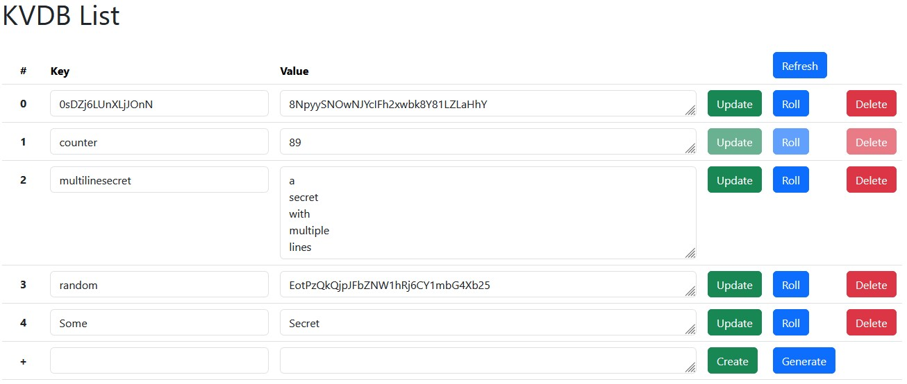

# Web Based Key Value Store GUI Interface
This is a supliment to the [Web Based Key Value Store](https://github.com/SimonStiil/keyvaluedatabase/) that provied a 
graphical user interface that allows configuration. 

The interface will currently be using a hardcoded user for accessing the keyvaluedatabase. And expects you to have a different login sollution in front of accesing the system like [Authelia](https://www.authelia.com/)

# Download
Docker image can be fetched from [ghcr.io simonstiil/kvdbweb](https://github.com/SimonStiil/keyvaluedatabaseweb/pkgs/container/kvdbweb)  
Can be build with go build .  
Will also be available as a release in releases in the future

# Configuration
Is done in config.yaml following the structure  
Example can be seen in [example-config.yaml](./example-config.yaml) 

## Command line options
| Option | Description |
| ------ | ----------- |
| -config=\[value\] | Use an alternate config filename then config.yaml (only write prefix as .yaml will be appended ) |

## Configuration Structure

| Option | Description ( Defaults ) |
| ------ | ----------- |
| debug | Enable debugging output (developer focused) |
| port | Port to host the service on (8080) |
| backend.port | Port to use to talk to backend (443) |
| backend.protocol | Protocol to use to talk to backend (https)  |
| backend.username | Username to connect to the backend (system) |
| prometheus | Prometheus settings |
| prometheus.enabled | Prometheus enabled (true) |
| prometheus.endpoint | Prometheus endpoint (/system/metrics) |

## Environmental Options

All configuration options can be set using Environment Values use uppercase and replace . with _ and append KVDBW_ prefix.  
Example:
| Option | Description |
| ------ | ----------- |
| KVDBW_BACKEND_PASSWORD | Enable debugging output (developer focused) |

# Usage

| Button | Description |
| ------ | ----------- |
|  | Refresh the site |
|  | Write changes in the key or value,changing the key will create a new key with same values (copying) |
|  | Generate a new random 32 character secret and insert it |
|  | Delete the key value pair |
|  | Create a new key value pair (enter both...) |
|  | Generate value or both key and value by leaving one or either filed empty |